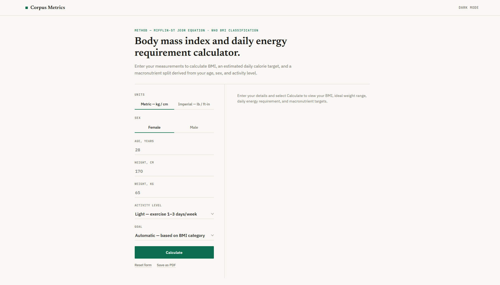
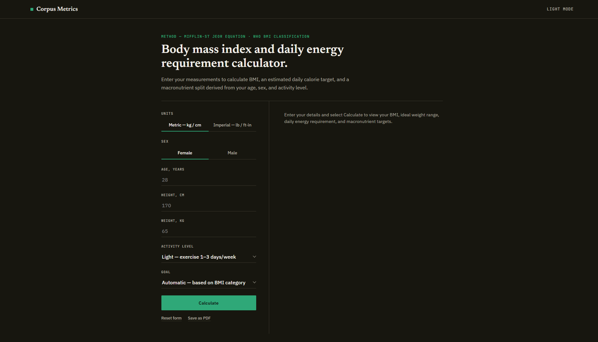
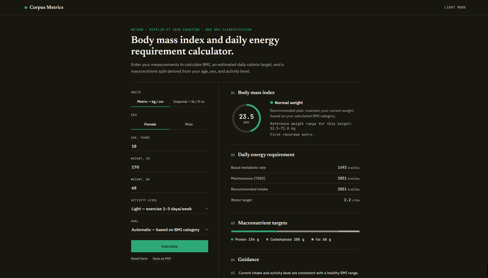
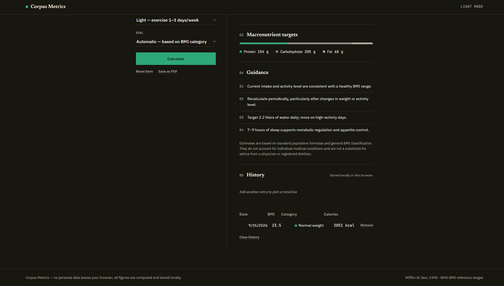

# BMI & Daily Energy Reference

A single-page, client-side BMI (Body Mass Index) calculator that also estimates a daily
calorie target and macronutrient split from age, sex, height, weight, and activity level.

## Features

- Metric or imperial units, sex selection, age/height/weight inputs
- BMI gauge with category (Underweight / Normal / Overweight / Obese)
- Ideal weight range for the given height
- BMR, TDEE (maintenance), recommended daily calories, and daily water target
- Macronutrient split (protein / carbs / fat) with an automatic or manual goal
- Guidance list tailored to the calculated BMI category
- Local history log with a BMI trend chart, delta vs. previous entry, and per-entry delete
- Light/dark theme, "Save as PDF" (browser print), and persisted last-used inputs
- Custom accessible dropdowns (keyboard + screen-reader friendly) instead of native selects

## Tech stack

Plain HTML, CSS, and JavaScript in a single file (`index.html`). No build step, no
dependencies, no framework. Fonts are loaded from Google Fonts (IBM Plex Sans, Newsreader,
JetBrains Mono).

## Running locally

Open `index.html` directly in a browser — nothing to install or build.

## Deployment

Deployed via Vercel, tracking the `main` branch of this repository.

## Screenshots

### UI

